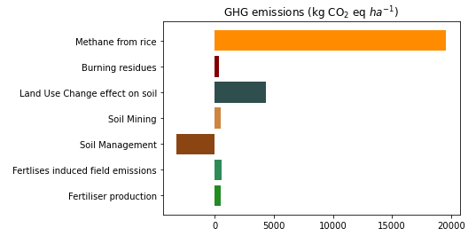

# Greenhouse gas (GHG) emissions for agriculture
<p align="center">


</p>


## Introduction

The GHG measurement, produced by agricultural activities such as fertilizers, irrigation, tillage, among others, is important for quantifying the impact that this sector has on climate change. For that reason, several methodologies have been proposed to address a baseline measurement using data from farmers. The main purpose of this repository is to offer a tool that is able to estimate GHG emissions for multiple commercial cropping events. It is important to mention that this work is based on the Mitigation Option Tool for Agriculture project ([CCAFS - MOT](https://ccafs.cgiar.org/research/projects/mitigation-options-tool-agriculture-ccafs-mot)) developed by CCAFS and The Aberdeen University. 


## Requirements

* Python Version >= 3.6
* Libraries:
```txt
    pandas==1.1.0
    rasterio==1.1.8
    matplotlib==3.3.2
    numpy==1.19.1
```
## Get started

The following example shows how to use this code for ghg emissions 

###  Organice your Input

The input files must contain a certain amount of parameters for each cropping event (please check the example located in the data folder).
There are two files, one refers to general information about the crop event, and the second one provides insights about the fertilizers used during the crop cycle.

The general information that is required for running the code is:

* id_event: This is an unique identification code for each crop event.
* longitude and latitude: these are the field spatial coordinates 
* crop: crop that was planted.
* crop_yield_kg_ha: crop productivity

The fertilizer file must have the following variables:

* id_event: This is an unique identification code for each crop event.
* fertliser_product: fertilizer that was used during the crop cycle.
* amount_kg_ha: how many kg/ha of fertiliser was added to the soil.

Moreover, there are other optional variables related to climate and soil. These insights can be provided by the users otherwise they are going to be inferred from secondary sources. for example, in the case of soil, we use the provided coordinates for extracting data from [SoilGrid](https://soilgrids.org/) project. For climate, we use the Saire's [climate region classification](https://www.sciencedirect.com/science/article/pii/S2351989419307231?via%3Dihub). 

Additional variables are explained in each excel file.

Once both files are filled with the required inputs, you can start with the code. 

```python
from scripts import crop_ghg_emissions as ghg

ghg_data = ghg.ghg_emissions('data/inputs_mot_example.xlsx', ## file path to the general information 
                             'data/fertiliser_inputs_mot_example.xlsx', ## file path to the fertilizers information   
                             id_event= 'event_7' ## you can ppoint out an specif crop event, or for run through the all events don't put this paremeter)
```
### Visualization

A bar blot is used to show the CO<sub>2</sub> eq . ha<sup>-1</sup> for each emission sources. 

```python
plot_functions.bar_plot_emissions(
    ghg_data.emissions_summary, #  table summary obtained from previous step
    'mean' # function to aggregated all crop events)

```
<p align="center">

</p>

### Data downloading

Finally, you can download the summary table, which is a pandas dataframe type. Only one parameter must be provided, the file output path.

```python
ghg_data.emissions_summary.to_csv("example.csv")
```

### Examples

Please feel free to check the example file created in [Colab](https://github.com/anaguilarar/ghg_emissions/blob/main/ghg_emissions_example.ipynb).

